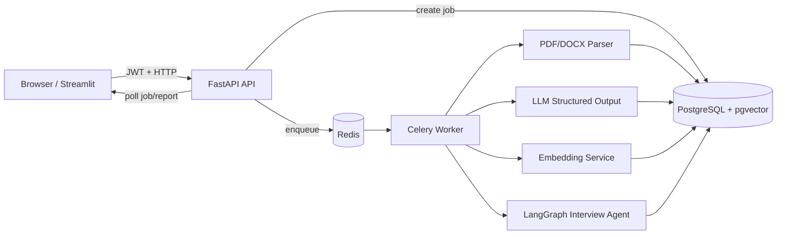
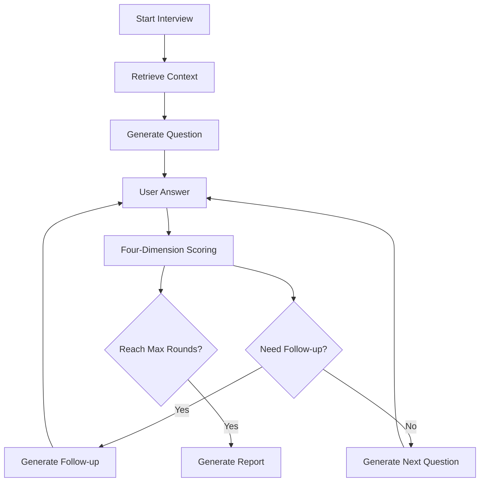

<div align="center">

# AI-Interview 智能模拟面试系统

面向 AI 应用开发工程师求职场景的模拟面试 Agent：上传简历和岗位 JD，系统自动解析、匹配岗位、检索个人项目证据，并用 LangGraph 编排“出题 -> 追问 -> 四维度评分 -> 报告”的完整训练闭环。

[](https://www.python.org/)
[](https://fastapi.tiangolo.com/)
[](https://github.com/pgvector/pgvector)
[](https://www.langchain.com/langgraph)
[](https://docs.celeryq.dev/)
[](https://docs.docker.com/compose/)

</div>

## 项目定位

普通刷题系统只会给固定题；直接问大模型又缺少工程化链路。AI-Interview 的目标是把“简历、岗位 JD、项目经历、题库知识和多轮面试反馈”串成一个可追踪、可复现、可解释的 AI 面试训练系统。

它不是单次 Prompt Demo，而是一个包含后端服务、数据库、向量检索、Agent 状态图、异步任务、权限隔离和 Docker 部署的完整 AI 应用原型。

## 核心能力

| 模块 | 已实现能力 | 面试可讲重点 |
| --- | --- | --- |
| 简历/JD 解析 | 支持 PDF、DOCX、TXT、Markdown 上传和文本提取 | 文件安全、扫描件 OCR 边界、异步解析 |
| 结构化抽取 | LLM 输出 Pydantic Schema：技能、项目、岗位要求 | 防幻觉、结构化校验、Prompt 版本化 |
| 岗位匹配 | 必备技能、加分技能、项目相关度加权打分 | 可解释评分，不让 LLM 随口给分 |
| RAG 检索 | 文档切块、Embedding、pgvector 余弦检索 | user_id 权限过滤、召回评测、向量库选型 |
| Agent 流程 | LangGraph 编排出题、评分、追问和下一题分支 | State/Node/Edge、终止条件、受控 Agent |
| 异步任务 | Celery + Redis 处理解析、向量化和模型调用 | API 不阻塞、任务状态、幂等和重试 |
| 部署运行 | Docker Compose 编排 API、Worker、DB、Redis、前端 | 可复现部署、健康检查、生产化差距 |

## 技术架构



## Agent 状态图



## 快速开始

> 默认 `LLM_MOCK=true`，不配置真实大模型 Key 也能先跑通业务流程。

```powershell
git clone https://github.com/<your-name>/ai-interview-system.git
cd ai-interview-system
Copy-Item .env.example .env
docker compose up -d --build
```

访问地址：

| 服务 | 地址 |
| --- | --- |
| 前端页面 | http://localhost:8501 |
| API 文档 | http://localhost:8000/docs |
| 健康检查 | http://localhost:8000/health |

## 本地验证

```powershell
docker compose ps
docker compose logs --tail 100 api
docker compose logs --tail 100 worker
docker compose run --rm api pytest -q
```

RAG 冒烟测试：

```powershell
docker compose run --rm api python scripts/smoke_rag.py
```

预期输出包含：

```text
RAG_SMOKE_OK
```

## 目录结构

```text
ai-interview-system/
|-- app/
|   |-- api/                  # FastAPI 路由：登录、上传、任务、面试
|   |-- services/             # 文件解析、LLM、匹配、RAG、LangGraph
|   |-- tasks/                # Celery 配置与后台任务
|   |-- config.py             # 环境变量配置
|   |-- database.py           # SQLAlchemy Engine/Session
|   |-- models.py             # PostgreSQL 表模型
|   `-- schemas.py            # Pydantic 请求、响应和 LLM 输出结构
|-- alembic/                  # 数据库迁移
|-- frontend/                 # Streamlit 前端
|-- scripts/                  # 冒烟测试与评测脚本
|-- tests/                    # 单元测试
|-- docs/                     # 架构、部署、面试答辩文档
|-- docker-compose.yml
|-- Dockerfile
`-- requirements.txt
```

## 关键接口

| 方法 | 路径 | 说明 |
| --- | --- | --- |
| POST | `/api/v1/auth/register` | 注册 |
| POST | `/api/v1/auth/token` | 登录并获取 JWT |
| POST | `/api/v1/resumes` | 上传简历并创建解析任务 |
| POST | `/api/v1/job-descriptions` | 上传或粘贴 JD |
| GET | `/api/v1/jobs/{job_id}` | 查询后台任务状态 |
| POST | `/api/v1/interviews` | 创建模拟面试 |
| POST | `/api/v1/interviews/{session_id}/answers` | 提交回答并触发评分 |
| GET | `/api/v1/interviews/{session_id}/report` | 获取面试报告 |

## 配置真实模型

开发阶段建议先使用 mock：

```dotenv
LLM_MOCK=true
EMBEDDING_BACKEND=hash
```

接入真实 OpenAI-compatible 模型：

```dotenv
LLM_MOCK=false
LLM_API_KEY=your_api_key
LLM_BASE_URL=https://api.openai.com/v1
LLM_MODEL=gpt-4.1-mini
EMBEDDING_BACKEND=sentence_transformers
EMBEDDING_MODEL=BAAI/bge-small-zh-v1.5
```

切换真实 Embedding 后，需要重新上传材料或清理旧向量，因为 `hash` 调试向量和真实语义向量不在同一空间。

## 工程化亮点

- 任务状态落库：`pending -> running -> success/failed`，失败可追踪。
- 长任务异步化：文件解析、Embedding、LLM 调用不阻塞 API。
- 资源权限隔离：业务查询和 RAG 检索均按 `user_id` 过滤。
- 结构化输出：LLM 结果经过 Pydantic Schema 校验。
- 数据库迁移：Alembic 管理 pgvector 扩展、业务表和索引。
- 可复现部署：Docker Compose 一键启动 API、Worker、Redis、PostgreSQL、前端。
- 测试覆盖：文本切块、文件清洗、岗位匹配和 LangGraph 分支均有测试。

## 文档

- [架构设计](docs/ARCHITECTURE.md)
- [部署指南](docs/DEPLOYMENT.md)
- [API 调用示例](docs/API_EXAMPLES.md)
- [面试答辩手册](docs/INTERVIEW_DEFENSE.md)
- [安全与上传前检查](docs/SECURITY_CHECKLIST.md)

## 项目边界

当前版本是可运行的本地工程化原型，重点展示 AI 应用落地链路。生产化仍需继续补齐：

- OCR、对象存储和文件生命周期管理
- Celery 幂等锁、死信队列、Transactional Outbox
- Prometheus、OpenTelemetry、Langfuse/LangSmith 可观测性
- 多租户、配额、限流、成本预算
- CI/CD、镜像扫描、备份恢复和压测

## License

MIT License. See [LICENSE](LICENSE) for details.
